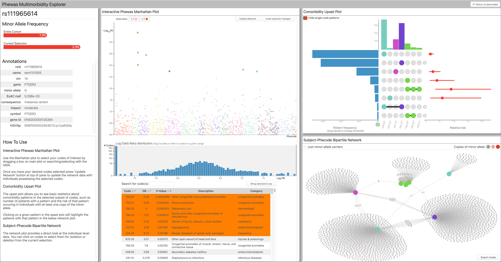
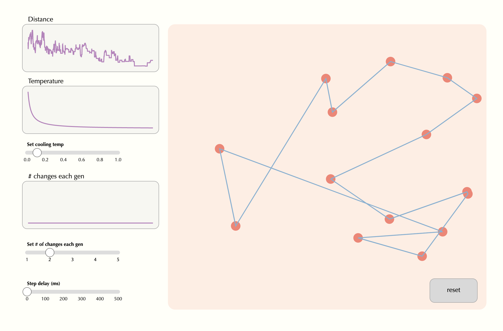
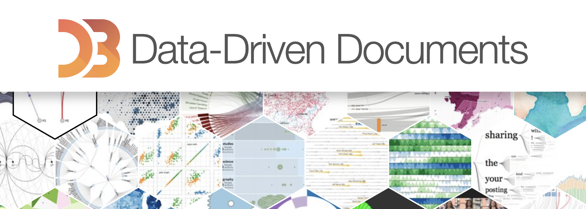
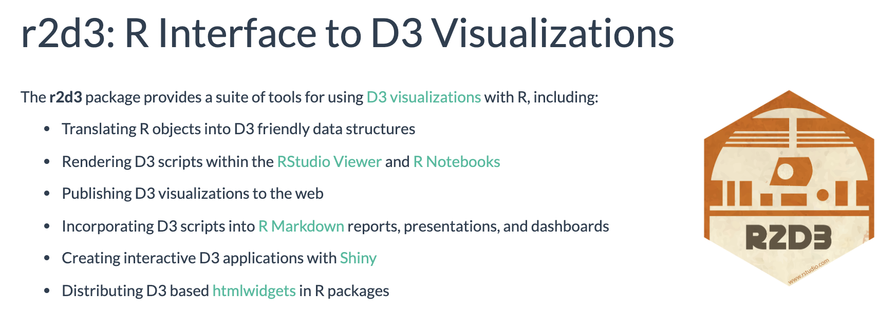
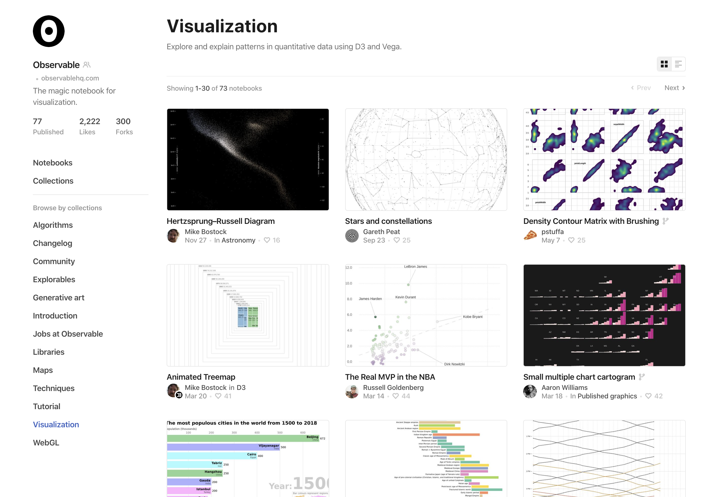
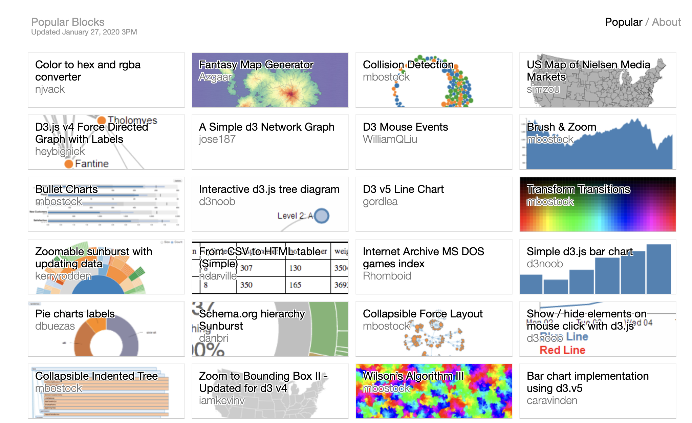
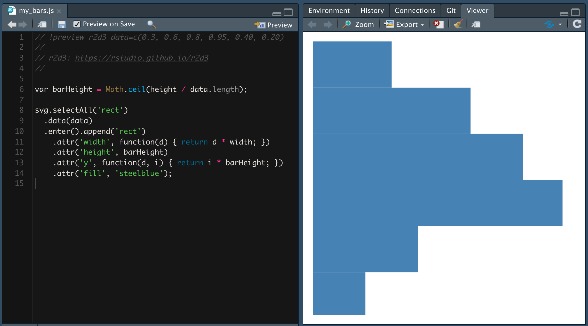
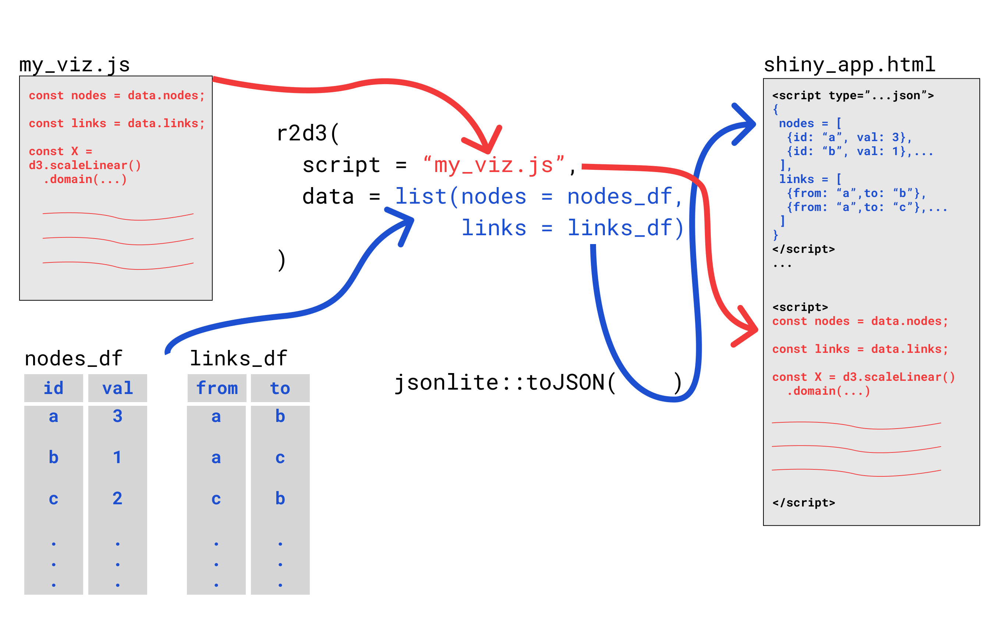
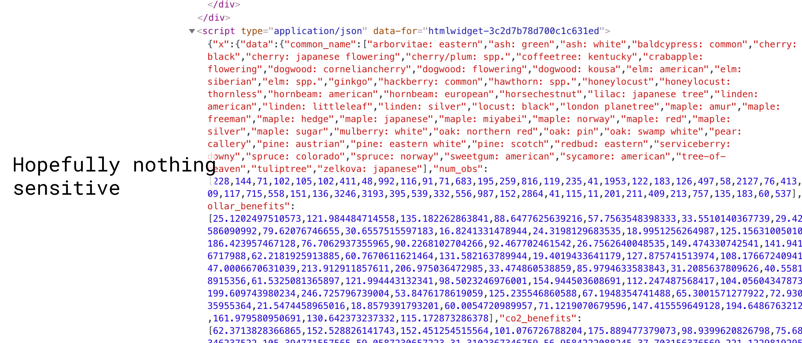

class: middle, center

```{r setup, include=FALSE}
options(htmltools.dir.version = FALSE)
```


# Repo: github.com/nstrayer/js4shiny_r2d3

--- 

# Slides: nickstrayer.me/js4shiny_r2d3/slides/

---

# Motivation


.pull-left[
  ## [Multimorbidity Explorer](https://prod.tbilab.org/phewas_me/)
  
  .shadowed[]
]

.pull-right[
  ## [The traveling metallurgist](https://livefreeordichotomize.com/2017/09/25/the-traveling-metallurgist/)
  
  .shadowed[]
]


---
# What is D3?

> __D__ata-__D__riven __D__ocuments

> D3.js is a JavaScript library for manipulating documents based on data. D3 helps you bring data to life using HTML, SVG, and CSS. D3’s emphasis on web standards gives you the full capabilities of modern browsers without tying yourself to a proprietary framework, combining powerful visualization components and a data-driven approach to DOM manipulation.

.shadowed[

]

---
class: middle

# What is R2D3?

R-Package that lets you write D3 (or any JS) code and display in an Rmd, standalone HTML file, or... __Shiny__.

.shadowed[

]

---
# How R2D3 makes things easier

.pull-left[
## For R 
  Custom visualizations from R focusing only on the visualization javascript.
  
  .center[.iconed[🧐]]
]

.pull-right[
## For JS
  Getting data is super easy. It just magically appears in your JS. 
  
  .center[.iconed[🚚]]
  
]


---
# When should you reach for R2D3?

.pull-left[
- You have decided you _need_ an interactive visualization

- The functionality is not available in more 'features-included' libraries
  - Plotly, VegaWidget,...

- You have the time...
]
.pull-right[


]


---
# Finding examples to use as starting point

.center[
 _Embrace the ctrl-C $\to$ ctrl-V_
]

.pull-left[
.center[
  ## [Observable](https://observablehq.com/)
]

- The RMD/Jupyter of JS
- Not _quite_ real JS
.shadowed[

]
]
.pull-right[
.center[
  ## [Bl.ocks](https://bl.ocks.org/)
]
- Full scripts for visualizations
- "Old" version of Observable
.shadowed[

]
]

---
# Writing your visualization
.center[
File $\to$ New File $\to$ D3 Script

.shadowed[

]

Now just save to update preview...
]

---

# How R2D3 works




---

# Limitations of R2D3

- You have to supply almost all the logic
- Data is in text
  - Can bog down browser with large amounts of data
  - It's all available for the world
- Isolated from rest of HTML (this is actually good...)

.shadowed[]

---

# Putting into Shiny

.pull-left[

## UI

Inserts R2D3 chart into the UI to be targeted with id `"d3"`.
```{r, eval = FALSE}
r2d3::d3Output("d3")
```
]

.pull-right[
## Server
Send R2D3 visualization to output element `"d3"`.
```{r, eval = FALSE}
output$d3 <- 
  r2d3::renderD3({
    r2d3::r2d3(...)
  })
```

]


---
# Wiring up communications to shiny from R2D3 viz.

Wire-up your JS to send a message to Shiny... 
.center[

]
.pull-right[.small_text[_Example from [R2D3 shiny article](https://rstudio.github.io/r2d3/articles/shiny.html)_]]


Now just access in your shiny app with 

```{r, eval = FALSE}
input$bar_clicked
```


